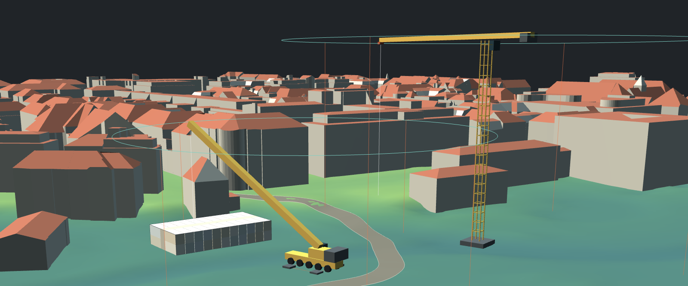

# Quick-Site-Design

*[Deutsche Fassung](README.md)*

**Plan your site layout while the idea is still fresh.**

Quick-Site-Design is a tool for the early stage of construction site layout.
Instead of estimating dimensions or pushing symbols around a site plan, you load
the official terrain model of your site and place what actually goes on it: site
offices, tower cranes, mobile cranes, haul roads. Everything to scale, everything
on real elevations.

The value is in the speed. A crane position is set in two minutes and moved in
two more. You see immediately whether the radius reaches, whether two crane radii
overlap, whether the office block fits the available area, and how the haul road
sits in the terrain. It does not replace detailed design — but it saves the
rounds in which that design would otherwise be discarded three times over.

Technically it is a single HTML file of roughly 140 KB. No server, no
installation, no build step. Open it, drop in a terrain model, get going.



**[→ Open the application](https://Mucnese.github.io/quick-site-design/)**

---

## What it does

**Geospatial data**
- GeoTIFF terrain models, several tiles at once. Pixels from all tiles are
  averaged into a common grid, so differing resolutions and overlaps are not a
  problem.
- CityGML LOD2, also as a batch. Axis order is detected automatically, buildings
  outside the tile are discarded.
- Detail level from 140 grid points up to the untouched source resolution.
- The coordinate reference system is read from the GeoKeys.

**Site elements**
- Container blocks up to 25 side by side, 2 rows, 5 storeys. With two rows a
  walkway one container wide is left between them, filled by a plain connecting
  block.
- 34 tower cranes from Liebherr and WOLFFKRAN, all figures taken from the
  manufacturers' original data sheets.
- 9 Liebherr mobile cranes from 50 t to 750 t.
- Haul roads as a polyline with filleted corners; the alignment drapes onto the
  terrain. Selecting a road reveals its nodes, which can be moved or deleted.

**Interaction**
- Left-click on terrain or buildings sets a measure point, shows easting,
  northing and elevation right at the point, and makes it the orbit and zoom
  centre.
- **2D** button resets the view to straight from above; dragging tilts it back
  into space. The compass shows north and orients to it on click.
- Warning when crane radii overlap; the haul road radius slider turns red as
  soon as the minimum radius no longer fits between the nodes.
- Two interface styles (dark and light), eleven typefaces, German and English.

---

## Demo

**[→ Open the demo](https://Mucnese.github.io/quick-site-design/?demo=1)**

The link loads terrain and buildings automatically. After a few seconds you have
a square kilometre of real terrain with 612 buildings — pick an element from the
bar at the bottom and click on the terrain.

The data set:

| File | Contents |
|---|---|
| `demo/demo_dgm.tif` | DTM, 1000 × 1000 points, 1 m grid, elevations 503.1 to 520.7 m |
| `demo/demo_lod2.gml` | LOD2 building model, 612 buildings, clipped to the tile |

ETRS89 / UTM zone 32N (EPSG:25832), south-west corner at E 692000 / N 5336000,
located at roughly 48.153 North and 11.588 East.

Load your own data through the two file inputs under **Data** — terrain first,
then buildings.

The data originates from official German surveying data. When reusing it,
observe the terms of the issuing state authority.

---

## Important note on the crane data

The crane figures are **guide values**. They come from the manufacturers'
published data sheets, but they depend on the rigging configuration, tower
combination and ballasting.

**For actual planning, only the load chart of the specific crane is
authoritative.** This application does not replace structural verification,
stability calculations, or coordination with the crane hire company.

Outrigger dimensions and carrier lengths serve presentation only and are
schematic.

---

## Where to get the data

In Germany, terrain and building models are available free of charge from the
state surveying authorities. The portals differ by federal state; search for
"DGM1" or "LoD2" together with the state name. Most states publish the data
under the Datenlizenz Deutschland.

The application expects GeoTIFF with elevation values as float and a
georeference in the header. For buildings, the usual LOD2 output of the German
states works as is. Data from other countries works too, as long as the GeoTIFF
carries a projected coordinate system and the CityGML uses the same one.

---

## Repository layout

```
quick-site-design/
├── index.html            the application, self-contained
├── README.md             German
├── README.en.md
├── PROJEKT.md            developer notes (German)
├── LICENSE
├── build.py
├── .gitignore
├── docs/
│   └── header.png        header image for the README
├── demo/
│   ├── demo_dgm.tif      terrain model for the demo link
│   └── demo_lod2.gml     building model for the demo link
├── src/
│   ├── shell_head.html
│   ├── app.js
│   ├── ui.js
│   └── boot.js
└── test/
    ├── test.js
    ├── test-ui.js
    ├── validate-html.js
    ├── demo-check.js
    ├── three-stub.js
    └── xml-stub.js
```

`index.html` is assembled from the four files in `src/` with
`python3 build.py`. The tests in `test/` run under `node` and need no browser.
Details are in `PROJEKT.md` (German).

---

## Running it yourself

`index.html` is self-contained. Three libraries are loaded from a CDN at runtime:

| Library | Licence |
|---|---|
| three.js r128 | MIT |
| OrbitControls (three.js examples) | MIT |
| geotiff.js 2.1.3 | MIT |

All three are compatible with the GPLv3. Without an internet connection the
application will not start; for offline use the libraries have to be shipped
alongside and referenced locally.

To run it on your own web space, put `index.html` in the web directory. If the
demo link should work too, the `demo/` folder has to sit next to it.

---

## Licence

Copyright © 2026 Haoran Li

GNU General Public License, version 3 or later. See [LICENSE](LICENSE).

In short: you may use, distribute and modify the software. If you distribute a
modified version, that version must also be under the GPLv3 and its source must
be available.

The software is provided without any warranty.
